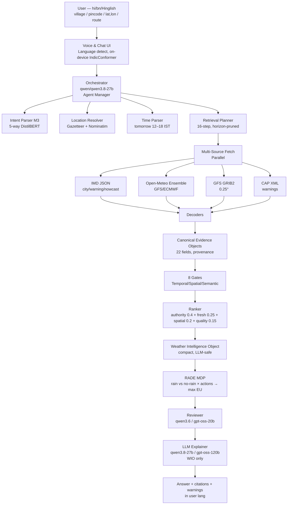
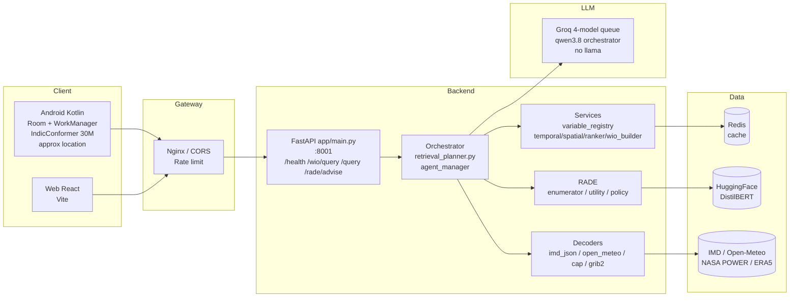
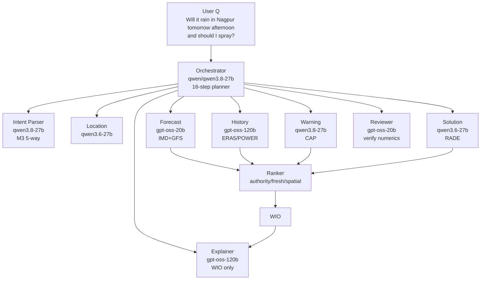
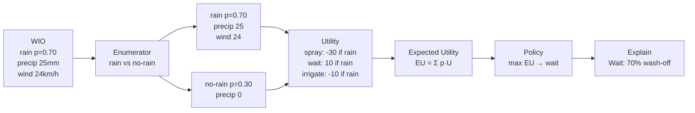
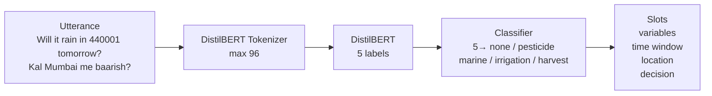
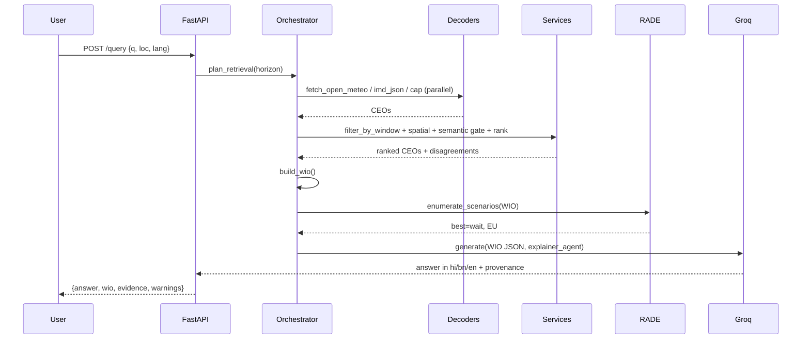
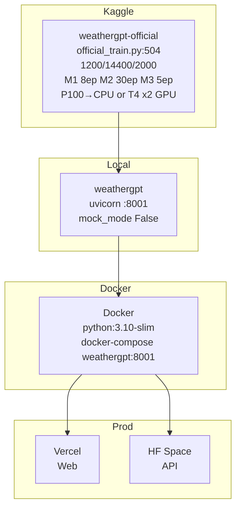

# WeatherGPT — Architecture

**Purpose:** Convert heterogeneous `point/grid/raster/polygon, observation/forecast/warning/satellite/radar/reanalysis` into provenance-preserving `CEO → WIO` that an LLM can safely explain. LLM never decodes GRIB/NetCDF.

**Repo:** `/home/anamitra/weathergpt` — `app/` 276 KiB, `training/` 748 KiB  
**Kaggle:** `weathergpt-official` P100→CPU (T4 x2 notebook available) — `official_train.py:504`  
**Groq:** `qwen/qwen3.8-27b` orchestrator + `qwen/qwen3.6-27b`, `openai/gpt-oss-20b`, `openai/gpt-oss-120b` (no llama)

---

## 1. Overall System — High Level



*Matches your `agentic_weather_diagram` (Orchestrator → Forecast/History/Solution/Reviewer → Explanation). 8 normalization layers: syntactic, unit, semantic, temporal, spatial, evidence-class, provenance, uncertainty.*

---

## 2. App Architecture — FastAPI + Agents



* `app/main.py:28` — `load_dotenv`, `CORS *`, `mock_mode` if no `GROQ_API_KEY`, `POST /wio/query` builds WIO (falls back `ceos[:20]` if filtered empty), `POST /query` adds RADE + `groq_client.generate(WIO JSON, explainer_agent)`.

---

## 3. AIML Interoperability Architecture — CEO → WIO

```mermaid
flowchart LR
    subgraph Sources
        S1[IMD JSON<br/>city/warning<br/>category_code<br/>colour]
        S2[Open-Meteo<br/>hourly 1h]
        S3[GFS GRIB2<br/>K→C, kg m-2→mm]
        S4[CAP XML<br/>severity→colour<br/>cancel lifecycle]
    end
    S1 & S2 & S3 & S4 --> D1[Syntactic<br/>bytes→objects]
    D1 --> D2[Unit<br/>pint, gated]
    D2 --> D3[Semantic<br/>variable_registry<br/>are_comparable()]
    D3 --> D4[Temporal<br/>filter_by_window<br/>issued vs valid]
    D4 --> D5[Spatial<br/>haversine<br/>rank_by_spatial]
    D5 --> D6[Evidence-Class<br/>warning≠forecast]
    D6 --> D7[Provenance<br/>transformations[]]
    D7 --> D8[Uncertainty<br/>prob / ensemble]
    D8 --> CEO[CEO<br/>22 fields]
    CEO --> WIO[WIO<br/>weather + warning + agreement]
```

**CEO** `app/schemas/ceo.py:80` — `evidence_id, source{IMD,GFS,WRF,ERA5,INSAT,RADAR,CAP,OPEN_METEO}, evidence_class{observation,forecast,nowcast,warning…}, variable{precipitation_amount, …}, value, unit, statistic{instant,accumulation,probability,categorical}, geometry{Point,Polygon,GridCell}, spatial_resolution, observed_at, issued_at, model_init, valid_from/to, lead_hours, accumulation_hours, vertical_level, ensemble_member, probability, quality_flag, confidence, warning_severity, ingested_at, provenance{original_source, original_unit, transformations[]}, extra`

**WIO** `app/schemas/wio.py:30` — `query{raw,resolved_location,valid_from/to,intent,lang}, weather{rain{value,prob,acc,source}, wind, temp}, official_warning{active,authority,severity,valid_until,provenance}, agreement{full/partial/conflict}, evidence[summary], disagreements[], wio_version`

---

## 4. Orchestrator — Multi-Agent (Groq 4-Model Queue)



`app/orchestrator/models.py:5` — `PREFERRED_MODELS [qwen3.8, qwen3.6, gpt-oss-20b, gpt-oss-120b]`, `ORCHESTRATOR_MODEL qwen3.8`, `AGENT_ROLES 8`, `model_for(role|int)` round-robin, queues for 5–6 agents (`agent 4→qwen3.8`, `5→qwen3.6`).

`app/orchestrator/groq_client.py:12` — `generate(messages, model_for(role))`, reads `GROQ_API_KEY` from env or `groq_api.txt`, hard-rejects `llama`.

---

## 5. RADE — Risk-Aware Decision Engine (MDP)



`app/rade/enumerator.py:10` `p = rain.probability or 0.5`, `utility.py:10` `spray:-30 if rain`, `policy.py:10` `max(scores)`.

---

## 6. ML Model Architectures — Individual

### 6.1 M1 Semantic Variable Classifier — 9-Label DistilBERT

```mermaid
graph LR
    IN[raw_field<br/>APCP / tp (mm)<br/>GFS:TMAX (°C)<br/>Heavy Rainfall warning] --> TOK[DistilBERT Tokenizer<br/>max_length 64]
    TOK --> BERT[DistilBERT<br/>distilbert-base-uncased<br/>6 layers, 66M<br/>66→768 dim]
    BERT --> CLS[Classifier Head<br/>768→9<br/>+ Weighted CE]
    CLS --> OUT[Canonical<br/>precipitation_amount<br/>t2m / tmax / tmin<br/>wind / gust / prob / rate / warning]
```

* `training/train_semantic_classifier.py:232` — `LABEL_MAP 9` (`precipitation_amount 0 … heavy_rain_warning 8`), `SYNTHETIC_PAIRS 35` + `field_names.csv 1200` diverse (`GFS:`, `IMD:`, `°C/mm/m/s`, `1,3,6,24h`), `make_dataset` dedup, `stratified 85/15`, `WeightedTrainer` `class_weights`, `Trainer processing_class`, `8ep bs32 lr2e-5`, `eval f1`.

### 6.2 M2 Bias-Correction — Deep MLP 5→128→128→64→2

```mermaid
graph TB
    IN2[Features 5<br/>gfs_t2m_K<br/>gfs_apcp_mm<br/>elevation_m<br/>lead_hours %72<br/>lat] --> SC[StandardScaler<br/>fit train only]
    SC --> L1[Linear 5→128<br/>ReLU + Dropout 0.15]
    L1 --> L2[Linear 128→128<br/>ReLU + Dropout 0.15]
    L2 --> L3[Linear 128→64<br/>ReLU + Dropout 0.1]
    L3 --> OUT2[Linear 64→2<br/>bias_t (°C)<br/>bias_p (mm)]
    OUT2 --> LOSS[MSE<br/>+ Brier precip>0.5]
    LOSS --> TGT[Target<br/>obs - forecast<br/>GFS K→C]
```

* `training/train_bias_correction.py:207` — `MLP 5→128→128→64→2`, `historical GFS (gfs_seamless) vs ERA5` 20 points ×30d×24h = `14400` rows, `lead %72` (was `0-239` sequential), `time-aware split 12240/2160 tail`, `StandardScaler` `scaler.pkl`, `AdamW 8e-4 CosineAnnealing 30ep bs256`, `rmse_t 1.34 rmse_p 0.19` (best `0.89`).

### 6.3 M3 Intent Parser — 5-Way DistilBERT (Groq-Diverse)



* `training/train_intent_parser.py:180` — `label_map 5`, `base_rows 1200 templates` + `Groq 800 paraphrases` via 4-model queue `qwen3.8×200 + 3.6×200 + gpt-oss-20b×200 + gpt-oss-120b×200` → `2000` deduped `1409 unique` → rebalance `600 none +350×4` = `2000`, `WeightedTrainer`, `5ep bs32`.

---

## 7. Data Flow — Query to Answer



---

## 8. Deployment



* `Dockerfile` + `docker-compose.yml` `weathergpt:8001`, `HF Space`/`Vercel` planned, Android `Room+WorkManager` + `IndicConformer 30M` offline + `SMS orange+`.

## 9. Technology Stack

`FastAPI+Pydantic | PyTorch 2.10+cu128 | Transformers 4.46+ DistilBERT | Datasets | scikit-learn | pandas | pint | shapely/pyproj | xarray/cfgrib (full) | httpx | paho-mqtt | Groq 4 models | Kaggle P100/T4 x2`

See `implementation.md` for code-level and `setup.md` for install.
