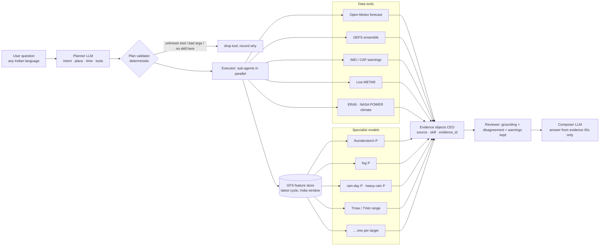

# WeatherGPT — agentic architecture with specialist models

Status: **data collected, extension features collecting, training next** (2026-10-06). Model results are filled in
only from `metrics.json` files produced by the training kernels — nothing in the
results sections is typed by hand. Sections marked `PENDING` have no numbers yet.

## 1. The idea in one paragraph

An **orchestrator LLM** reads the user's question, decides *which* tools are needed,
and the system runs only those: live weather APIs for what is happening and what the
big NWP models say, and **small specialist models — one per weather target** — for
calibrated probabilities and *ranges* (rain yes/no, thunderstorm yes/no, fog, hot day,
tomorrow's high as 10th–90th percentile, ...). A deterministic layer sits between the
LLM and the tools so the LLM can choose, but can never invent a tool, a number, or a
source. A composer LLM then writes the answer from evidence objects only.

## 2. What routing actually buys (and what it does not)

Be honest about the economics, because it decides the design:

* A LightGBM prediction takes milliseconds. Calling all 17 specialists would cost
  essentially nothing in compute. **Compute is not why we route.**
* What *is* expensive: network data tools (HTTP timeouts, rate limits), LLM context
  tokens, and the failure surface of every extra source. Routing keeps the fetch
  small, the context clean, and avoids showing the user contradictory evidence for a
  question they did not ask (a fog probability in an answer about monsoon rain).
* The real second benefit is **skill gating**: each model ships held-out skill by climate
  zone and lead time. If a model has no demonstrated skill where the user is, the
  validator drops it and the answer says so, instead of printing a confident number.

## 3. Components and where they live

| component | owner | location | status |
|---|---|---|---|
| Planner LLM + plan validator | app | new `app/agentic/` (proposed) replacing keyword `build_retrieval_plan` | designed, not built |
| Data tool adapters | app | `app/adapters/*` (exist) + new `metar_live` | exist / one new |
| Specialist models + feature store | ML | `event_models/` (training) → `weathergpt_events/` (inference package, as `weathergpt_models` is) | training in progress |
| Evidence objects, reviewer, WIO | app | `app/schemas/ceo.py`, `app/agents/orchestrator.py` | exist |
| Skill cards / gating table | ML | `metrics.json` per model, loaded by the registry | produced by training |

The existing `run_all_agents` filters one shared evidence list by class — nothing in it
is routed. The new executor replaces *that function*; `/query`, WIO, CEOs and the
reviewer stay. Existing CEO variables already cover most outputs
(`thunderstorm_probability`, `visibility`, `wind_gust`, `temperature_max/min`,
`precipitation_probability`, `rainfall_distribution`, `heat_warning`).

### Roles that older models played

| old | fate | why |
|---|---|---|
| M3 intent/slot parser | **replaced by the planner LLM** | intent + slots + 13 languages is LLM-shaped; M3's intent head was weak on natural phrasing (confidence 0.15–0.19), its variable head unusable |
| M1 field mapper | not needed by this design | schema mapping is not on the query path |
| M5 trust ranker | **replaced by skill gating** from held-out metrics + abstention | a table of measured skill is simpler and more honest than a learned ranker |
| M2 MOS / M4 rain calibration | **kept**, benchmarked against the new models | trained on ERA5 truth over 127 districts; the new models use observed truth (METAR/CHIRPS) |

Nothing is deleted; the published `Arko007/weathergpt-models` bundle stays as is.

## 4. Data foundry (everything collected from public sources, no keys)

Why these sources: ERA5 has **no** thunderstorm, fog or visibility fields (CAPE and
visibility came back 100% null from the Open-Meteo archive — verified), so events need
real observations. The free Open-Meteo API bills by variables × days and its archive of
non-GFS models starts only in 2023–24, so bulk multi-year forecasts came from NOAA's
archives on AWS instead (no rate limit; byte-range GRIB subsetting, ~55 MB/s).

| layer | source | coverage | what we verified |
|---|---|---|---|
| Event truth | IEM METAR archive, `IN__ASOS` | 142 stations with data, half-hourly, 2016→now | 7,914,643 reports; 4,570,272 labelled station-hours; 105,100 thunderstorm / 95,702 fog / 29,813 strong-wind / 312,069 rain / 13,929 dust hours; 264,764 station-days |
| Rain truth | CHIRPS-2.0 daily 0.05° | whole India window, 2016-01-01 → 2026-08-31 (3,896 days, 0 missing) | ocean = −9999 with **no** nodata flag (masked explicitly); wet-day share tracks known climate (2023 El Niño driest, 2020 wettest) |
| Forecast inputs | NOAA GFS 0.25° (`noaa-gfs-bdp-pds`) | 2021-04-01 → 2026-10-03 (GFS v16 era), 00Z runs, 3-hourly to 72 h then 6-hourly to **240 h = forecast days 0–9** | 18 base fields; 2,012 run dates; ~0.1% of messages corrupt on NOAA's side (see below) |
| Ensemble | NOAA GEFS 0.25° mean + spread (`noaa-gefs-pds`) | same runs; archive starts 2017 | ensemble APCP, CRAIN (share of members raining), CAPE, PWAT, T2m, 6 h Tmax/Tmin, gust, helicity; sane at a monsoon point (mean 1.7 mm, spread 0.7, GFS 2.06) |
| Extension predictors | derived from GFS + GEFS | every second run date (1,006 runs), 52 steps | 95 step-level + 102 day-level columns: 850/700/500/200 hPa winds, omega, vorticity, moisture-flux convergence, K-index, total totals, lapse rate, shear, upslope flow, pressure gradient, skin temperature, soil moisture, radiation, cloud layers, helicity, multi-scale (0.5°/1°) neighbourhood statistics and neighbourhood rain probabilities, terrain complexity |
| Domain | 0.5° land nodes of the 6–38°N × 67–98°E box + METAR stations | 2,573 nodes + 136 stations | a box, not a legal outline: no border is drawn and edge regions get context |

Row counts (exact where stated):

* GFS station-step rows (136 stations × 32 steps × 2,012 runs): **8,756,224** (short horizon);
  point-day rows (2,709 points × 5 days × 2,012 runs): **27,252,540**. The long horizon
  (days 5–9) and the extension predictors cover every second run date.
* The old D1 corpus (9,582,912 rows) was 127 places × 1 year × 4 models × 8 lead ages; the
  new data has 21× more places and ~5.5× more years. Rows are not independent: neighbouring
  places and consecutive days share weather, so independent weather situations are far fewer
  than rows. What the longer history buys is coverage (five monsoons, five winters).
* Exact post-join training counts are printed by the table builder, not estimated here.

Known limits, stated up front:

* `p01i` (hourly precipitation) in METAR reads 100 % valid but Indian METARs do not
  report it — treated as zero-filled and **not used**. Rain truth at stations is the
  present-weather code (RA/DZ/SHRA/TSRA); amounts come from CHIRPS.
* **The rain labels are noisy, and we measured how noisy.** Against independent METAR rain
  reports at the same station-days (185,664 of them), CHIRPS cell rain ≥ 1 mm coincides with an
  airport rain report on 69.5 % of rain days and also fires on 15.1 % of airport-dry days;
  ranking agreement is AUC 0.81 overall and only **0.71 in the monsoon** (airport spot checks
  vs a 5 km satellite+gauge estimate: different representativeness, and METAR misses rain
  between observations). Probabilities are therefore calibrated to CHIRPS, not to a gauge.
* METAR labels are *airport* observations. "Thunderstorm" means TS/VCTS reported at the
  station in a 3-hour window, not "somewhere in the 25 km cell".
* **Corrupt source data:** on 2022-11-30 nine forecast steps are unreadable in NOAA's own
  archive (every message in those files fails framing after retries — this crashed the first
  collector). The hardened collector skips them; training drops any day that ends up
  incomplete (rain day needs all four 6-hour buckets).
* GFS and GEFS are used for the training period. Daily Tmax/Tmin from 3-hourly steps (≤72 h)
  or 6-hourly (>72 h) are slightly low-biased; the ensemble 6-hour Tmax/Tmin windows fix most of it.
* CHIRPS is satellite+gauge, weaker over high mountains and for short intense convective cells.

## 5. The specialist models (one model per target)

Every model is gradient boosted trees (CPU; tabular data — a GPU would not help),
fed forecast-run features only (never anything observed after the run).

| model | kind | truth | what it answers |
|---|---|---|---|
| thunderstorm | probability | METAR TS/VCTS in a 3 h window | will it thunder at this place around that time |
| fog | probability | visibility < 1 km | fog risk |
| strong_wind | probability | peak gust-or-mean ≥ 25 kt | damaging wind risk |
| rain_3h | probability | METAR RA/DZ/SHRA/TSRA in a 3 h window | rain in the next few hours (station-calibrated) |
| dust | probability | DU/SA/SS/DS/PO | dust raising (rare) |
| temperature / wind / humidity range | q10 · q50 · q90 | METAR hourly obs | hourly value as a **range** |
| hot_day / cold_night | probability | IST-day Tmax ≥ 40 °C / Tmin ≤ 5 °C | very hot / cold days |
| **heatwave_imd / coldwave_imd** | probability | IMD criteria vs the station's own 2016–2023 normal (plains Tmax ≥ 40 & +4.5 °C or ≥ 45 °C; hills ≥ 30 & +4.5 °C) | official heat / cold wave — NaN where no normal exists, never "false" |
| tmax / tmin range | q10 · q50 · q90 | METAR IST-day extremes | tomorrow's high and low as a range, days 1–9 |
| **rain_curve** | exceedance curve P(share of 0.5° cell ≥ t), 16 thresholds 0.1 … 204.5 mm, monotone in t by construction | CHIRPS | one coherent answer to "will it rain and how much" (below) |
| rain_3day_any / rain_3day_total | union / total over 3 days | CHIRPS, pixel-level | "rain in the next 3 days" is **not** the product of three daily probabilities |
| rain_7day_any / rain_7day_total | union / total over 7 days | CHIRPS, pixel-level | "rain this week" and "how much this week" as one distribution |

### 5.1 "Rain: yes or no — and if yes, how much" (the design, and the edge cases it exists for)

One model learns the whole **exceedance curve** S(t) = P(a random point in the 0.5° cell
receives ≥ t mm in the UTC day) for 16 thresholds that include every IMD boundary (2.5 rainy
day, 15.6 moderate, 64.5 heavy, 115.6 very heavy, 204.5 extremely heavy). Everything the user
asks is *derived* from it (`event_models/rain_products.py`), so the answers cannot contradict
each other:

* `p_any_rain` = S(1 mm); `p_rainy_day` = S(2.5 mm); heavy-rain probability = S(64.5 mm)
* IMD class probabilities (they sum to P(≥ 0.1 mm))
* "if it rains, how much": conditional quantiles of the amount given ≥ 1 mm (10th / 50th /
  90th), `NaN` when P(rain) < 2 % — an amount for a dry forecast would be invented
* the probability means "chance a point in the area gets it", matching the operational PoP
  definition (confidence × area), not "share of the area" alone

Edge cases and how each is handled:

| edge case | handling |
|---|---|
| independent threshold models contradict each other (P(≥15 mm) > P(≥2.5 mm)) | one stacked model, `log(threshold)` has a **monotone-decreasing constraint**; calibration is per threshold followed by a cumulative-minimum, so coherence holds for every input |
| unconditional amount range on a zero-inflated variable (q10 = q50 = 0) | no unconditional quantile model; amount is conditional on "wet", derived from the curve |
| rare heavy classes (a few cells in millions) | importance-sampled training (heavy rows ×12 over dry, weights 1/p keep it unbiased) and they borrow strength from lighter thresholds via the shared curve; thresholds with < 300 validation events keep the monotone model's own output (no noisy isotonic step function) |
| skill vs one global base rate is inflated (season + region alone beat it) | every probability is scored against **zone × month** climatology (and the place's own monthly rate where it exists), and against a **one-variable calibrated GFS** baseline |
| NWP rain is right but in the wrong place/time (double penalty) | neighbourhood features at 0.5° and 1° incl. neighbourhood rain probabilities, plus GEFS ensemble spread |
| a multi-day question | separate union and total targets, learned at pixel level — consecutive days are correlated |
| day boundaries (CHIRPS = UTC day; IMD = 08:30–08:30 IST; users = IST day) | documented, not hidden: daily rain models describe the **UTC day (05:30–05:30 IST)**; "later today" questions use the 3-hour station model; sub-daily *amounts* have no gridded truth and are not claimed |
| dry zone / dry season (P ≈ 0, BSS undefined) | zone/lead breakdowns with minimum counts; the skill gate falls back to climatology (shipped as `climatology.json`) |
| ocean, outside the box, or no GFS run | land-only domain; the validator refuses and the answer says so |
| label noise (CHIRPS vs airport METAR, §4) | measured and disclosed; verification is against CHIRPS only |
| spatial leakage between neighbouring cells | hold-out by 4°×4° **blocks**, 5-day gaps between train/val/test in time |
| calibration drift (val 2024 vs test 2025–26) | reliability reported on test; drift across seasons visible in the breakdowns |

### 5.2 Predictor families (no compromise, each with a physical reason)

surface and instability (CAPE surface / mixed-layer / 255–90 hPa, CIN, lifted index, reflectivity,
visibility, gusts, PWAT, CWAT, boundary-layer height, cloud layers) · upper-air dynamics
(850/700/500/200 hPa winds, omega, vorticity, divergence, moisture-flux convergence, K-index,
total totals, lapse rate, thickness, vertical shear) · orographic (upslope wind, terrain
relief/slope/roughness) · energy and moisture (skin temperature, soil moisture, radiation,
sensible/latent heat flux) · **ensemble** (GEFS mean and spread of rain, CRAIN, CAPE, PWAT,
temperature, 6-hour Tmax/Tmin, gust, helicity) · multi-scale neighbourhoods · step-to-step
tendencies · **forecast-climatology anomalies** (each variable minus that place's typical forecast
for that time of year, fitted on pre-validation forecasts only — no observation involved) ·
local **solar** time (the diurnal cycle follows the sun; India spans two hours of it) · static
geography.

### 5.3 Evaluation (identical for every model, implemented once in `event_models/train.py`)

* three reported sets: `val` (early stopping + calibration only), `test_time` (same places,
  future dates, from 2025-01-06) and `test_space` (4°×4° blocks the model never saw, future dates);
* gaps between periods are dropped (forecast errors are autocorrelated for days);
* probabilities: Brier skill vs **global, zone × month and point × month climatology**, AUC,
  PR-AUC, reliability, and CSI/POD/FAR against a **single-feature physical rule tuned on the same
  validation data** — so the claim is "beats the best simple threshold on the raw forecast";
* rain curves additionally: monotonicity check, skill vs a calibrated one-variable GFS, per-zone and
  per-lead skill at the key thresholds, and a "how much" score — conditional-median amount vs the
  pixel-level truth against the raw GFS amount;
* ranges: pinball loss, coverage and width vs a static-width interval around the raw GFS value,
  median MAE vs raw GFS, a conformal margin fitted on validation and re-checked on both test sets,
  and **per-zone coverage including the static interval's** (the property that matters is uniform
  coverage — a static interval over-covers calm conditions and under-covers rough ones);
* everything is broken down by climate zone, lead time and season.

Results: full tables **PENDING** (copied verbatim from the training kernels' `metrics.json`). **Preliminary first run** (kernel
`base-events`: base features only, hash-only hold-out that left three zones without held-out places — since fixed by a zone-stratified
hold-out): skill over zone × month climatology on places never seen, future dates (4,352,178 labelled station-steps):
thunderstorm AUC 0.82 / BSS +0.066, fog 0.86 / +0.069, strong wind 0.83 / +0.051, rain-in-3h 0.82 / +0.091. To be re-run with the
fixed split and the extension features before any of this is quoted as final.

## 6. Serving: the feature store

A model's inputs are GFS fields at the user's location. To avoid train/serve skew the
serving side reproduces the training extraction exactly: `event_models/collect_gfs.py`
already fetches the needed GRIB messages by byte range and decodes them. In production
this runs as a small job per GFS cycle, writes the India window (18 fields × 32 steps ×
129 × 125) to disk, and every query then does a bilinear lookup and a ~10 ms model call.
Open-Meteo's own GFS series is deliberately **not** used as model input — its variables
and interpolation differ from what the models were trained on.

## 7. Planner design

* Input: question, optional profile, **a compact tool catalogue** (name, one-line
  purpose, applicable horizon, validated zones, cost class) — not the whole schema.
* Output: strict JSON `{place, time_window, intent, tools:[{name, args}], needs_clarification}`.
* Plan validator (deterministic): tool exists; args type-check; horizon within the tool's
  range; location inside the validated domain; model skill table says `skill_ok(zone,
  lead)`; otherwise the tool is dropped and the reason is attached to the answer.
* If the LLM is unavailable or returns invalid JSON, fall back to the existing keyword
  planner — the system degrades, it does not fail.
* Evaluation of routing: the D4 v2 corpus (4,027 multilingual queries with intent and
  variable labels) is reused as the planner test set: tool-recall, tool-precision and
  over-selection rate per language. This is a measurable target, not a vibe.

## 8. What this does not do (so nobody is surprised)

* It does not beat the underlying NWP at everything; the claim is *calibrated risk and
  honest ranges around GFS*, validated on unseen places and future dates.
* Cyclones, floods and nowcasting under ~3 h are **not** covered by learned models —
  they stay with IMD/CAP warnings and live METAR. Too few labelled events / no radar.
* Probabilities for rare events (dust, dense fog, gales) may be too uncertain to show;
  the skill gate decides, per zone.

## 9. Roadmap

| step | state |
|---|---|
| source feasibility probes (METAR, CHIRPS, GFS, GEFS on AWS) | done |
| truth collector (METAR + CHIRPS) | done |
| GFS base collector, 2,012 runs, days 0–4 | done (one corrupt NOAA date, handled) |
| GFS base long horizon (days 5–9), every second run | running |
| extension predictors (dynamics, ensemble, neighbourhoods, terrain), 52 steps, days 0–9 | running (4 shards) |
| trainer, curve model, windows, IMD labels, anomalies — synthetic + full-pipeline tests | done |
| train 18 models (5 kernels) | after extension collection |
| ablation: base-only vs extension features | after training (same targets with `USE_EXT=0`) |
| inference package `weathergpt_events` + tool descriptors | after training |
| planner + validator + executor in `app/` | design only; owned by the app side |
| nowcast with live observations (nearest-station obs as features), 12Z cycle, odd run dates, gridded temperature truth | v1.1 |
